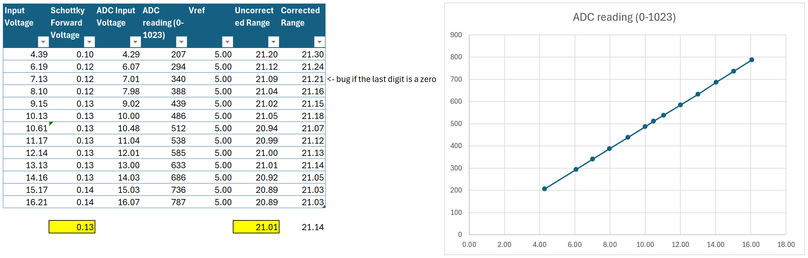

# Battery Charge Indicator

Battery Charge Indicator is an ATTiny84-based embedded monitor for lead-acid battery charging systems.

The firmware determines whether charging is active by combining three inputs:

1. Mains AC detection at the charger input (nominal 240V, detected via an isolated/no-contact sensing path).
2. Primary battery DC level above a charging threshold.
3. Secondary battery/house-master channel condition indicating the system state allows charging indication.

When charging is detected, a 12V output runs a repeating PWM fade cycle to drive an external indicator LED. The board also drives onboard status LEDs for quick diagnostics.

## 1) Functionality

### High-level behavior

At runtime, the firmware continuously evaluates three channels:

- **Mains channel** (`channelMains`): checks for a stable AC waveform around 50Hz.
- **Primary channel** (`channelPrimary`): checks DC voltage against a charging threshold.
- **Secondary channel** (`channelSecondary`): checks DC state used as an interlock/condition.

Charging is considered present only when all are true:

- mains AC present,
- primary battery voltage present (above threshold),
- secondary channel **not** present.

This logic is implemented in `IsCharging()` in `src/main.cpp` with a debounce window to avoid false transitions.

### Debounce and signal conditioning

- **Charge-state debounce:** `DEBOUNCE_HYSTERISIS_MS` (default `1000 ms`) requires stable readings before state changes.
- **AC detection debounce:** mains detection validates repeated leading edges in a 50Hz timing window:
	- min interval `15 ms`
	- max interval `25 ms`
	- continuous detection timeout/hysteresis `200 ms`

### PWM output behavior

When charging starts:

- output fade cycle starts (`Fader::StartFade()`),
- brightness ramps up and down using `analogWrite()`,
- step and timing are controlled by:
	- `OUTPUT_PWM_FADE_STEP` (default `4`)
	- `OUTPUT_PWM_FADE_MILLIS` (default `10 ms`)
	- `OUTPUT_PWM_CYCLE_MILLIS` (default `3000 ms` between cycles)

When charging stops:

- fade is stopped gracefully (`Fader::StopFade()`),
- output returns to off state at the end of the current fade cycle.

### Default ATTiny84A channel configuration

Defined in `src/config.h`:

- **Primary sense pin:** `D2`, threshold `13.0V`, scale `21.01V`
- **Secondary sense pin:** `D3`, threshold `10.0V`, scale `21.01V`
- **Mains sense pin:** `D0`, digital threshold `LOW`
- **PWM output pin:** `D8`
- **Onboard LEDs:** primary `D9`, secondary `D10`, mains `D7`

### Startup behavior

On boot (normal mode), the firmware:

1. initializes sensing channels and output,
2. flashes each onboard channel/output LED (`START_FLASHES`, `START_FLASH_MS`),
3. waits `START_DELAY_MS` before entering main loop.

### Optional operating modes

Compile-time options in `src/config.h`:

- `ENABLE_FUSE_REPORT_MODE`: read and print ATTiny84A fuse bytes and fuse bit breakdown over serial at startup
- `ENABLE_WATCHDOG_TIMER` : enable the watchdog timer for automatic recovery from lockups.
- `ENABLE_CALIBRATION_MODE`: samples ADC channels and blinks out measured values for field calibration.
- `ENABLE_PIN_TEST_MODE`: basic pin/LED test routine (`src/pintest.h`) for validating board mapping and outputs.

## 2) Source Code and Build (PlatformIO)

### Repository layout

- `src/main.cpp`: application setup/loop and charging-state logic.
- `src/channel.h/.cpp`: generic channel abstraction, DC thresholding, AC edge timing.
- `src/fader.h/.cpp`: PWM fade output state machine.
- `src/config.h`: target, pins, thresholds, timing constants, feature flags.
- `src/pintest.h`: pin test helper mode.
- `platformio.ini`: build environment (`attiny84`), upload protocol (`usbasp`), CPU clock, variant.

### Toolchain

- [PlatformIO](https://platformio.org/) with VS Code, or PlatformIO Core CLI.
- AVR target from `platformio.ini`:
	- platform: `atmelavr`
	- board: `attiny84`
	- framework: `arduino`
	- upload protocol: `usbasp`
	- MCU: `attiny84`
	- frequency: `8000000L`
	- variant: `tinyX4_reverse`

### Build and upload using VS Code

1. Open this folder in VS Code.
2. Ensure PlatformIO extension is installed.
3. Open the PlatformIO panel.
4. Under **Project Tasks -> attiny84**:
	 - run **Build** to compile,
	 - run **Upload** to flash via USBasp.

### Build and upload using CLI

From the project root:

```bash
pio run
pio run -t upload
```

### Setting bootloader/fuse for fresh ATTiny84A devices

The source comments in `src/main.cpp` include detailed instructions for preparing a fresh ATTiny84A with USBasp, including:

- core board options,
- expected fuse values,
- pin mapping requirement (**Clockwise** mapping),
- proof-of-life LED checks,
- recovery pointer for high-voltage serial programming if needed.

`platformio.ini` also sets expected signature/fuse values.

The tool AVRDUDESS at (https://github.com/ZakKemble/AVRDUDESS)[https://github.com/ZakKemble/AVRDUDESS] is also easy to set fuse bits.

To check fuse settings run the provided script in Powershell:

```bash
.\tools\read-attiny84a-fuses.ps1 -AvrDude "C:\Program Files (x86)\AVRDUDESS\avrdude.exe" 
```

Or alternatively run: 

```bash
avrdude -c usbasp -p t84 -U efuse:r:-:h -U hfuse:r:-:h -U lfuse:r:-:h
```

Expected values are:

```bash
ATtiny84A fuse report
--------------------
LFUSE: 0xE2
HFUSE: 0xDC
EFUSE: 0xFF

Low fuse (LFUSE)
  CKDIV8     OFF (bit7=1) - Clock divide-by-8 enabled
  CKOUT      OFF (bit6=1) - System clock output on CLKO enabled
  SUT1       ON  (bit5=1) - Start-up time select bit 1
  SUT0       OFF (bit4=0) - Start-up time select bit 0
  CKSEL3     OFF (bit3=0) - Clock source select bit 3
  CKSEL2     OFF (bit2=0) - Clock source select bit 2
  CKSEL1     ON  (bit1=1) - Clock source select bit 1
  CKSEL0     OFF (bit0=0) - Clock source select bit 0
  SUT[1:0]      0b10
  CKSEL[3:0]    0b0010

High fuse (HFUSE)
  RSTDISBL   OFF (bit7=1) - External RESET pin disabled
  DWEN       OFF (bit6=1) - debugWIRE enabled
  SPIEN      ON  (bit5=0) - ISP serial programming enabled
  WDTON      OFF (bit4=1) - Watchdog always on (hardware forced)
  EESAVE     OFF (bit3=1) - EEPROM preserved through chip erase
  BODLEVEL2  ON  (bit2=1) - Brown-out level select bit 2
  BODLEVEL1  OFF (bit1=0) - Brown-out level select bit 1
  BODLEVEL0  OFF (bit0=0) - Brown-out level select bit 0
  BODLEVEL[2:0] 0b100

Extended fuse (EFUSE)
  RES7       ON  (bit7=1) - Reserved (typically left as 1)
  RES6       ON  (bit6=1) - Reserved (typically left as 1)
  RES5       ON  (bit5=1) - Reserved (typically left as 1)
  RES4       ON  (bit4=1) - Reserved (typically left as 1)
  RES3       ON  (bit3=1) - Reserved (typically left as 1)
  RES2       ON  (bit2=1) - Reserved (typically left as 1)
  RES1       ON  (bit1=1) - Reserved (typically left as 1)
  SELFPRGEN  OFF (bit0=1) - Self-programming (SPM) enabled

Note: many AVR fuse features are active-low (bit = 0 means programmed/enabled).
```

Notes: 
1. Its essential to keep pin mapping/clock settings aligned with your board core configuration when burning fuses.
2. Many AVR fuse features are active-low (bit = 0 means programmed/enabled).
3. Enabling BOD increases power consumption slightly.
4. Higher BOD thresholds can cause more frequent resets on brief supply dips.
5. If the MCU appears unresponsive after incorrect fuse settings, use HV rescue tooling as referenced in the source comments.

### Calibration

Calibration of the 12V sense lines is performed manually and adjusted in source code. The input voltage range is approximately 0VDC to +20VDC, and ADC response is reasonably linear, as follows:



- `design/calibration.xlsx`: calibration data workbook.
- `design/calibration.png`: calibration reference graphic.

### Brown-out Detection (BOD)

Brown-out Detection is an ATTiny hardware protection feature that keeps the MCU in reset when supply voltage drops below a configured threshold, to prevents unstable code execution during low-voltage events. This reduces risk of corrupted state, bad ADC readings, and EEPROM write issues.

The MCU restarts cleanly when Vcc returns above the threshold.

### Watchdog Timer

Watchdog support is enabled in firmware (`ENABLE_WATCHDOG_TIMER`) with a configurable timeout (`WATCHDOG_TIMEOUT`, currently 4 seconds).

Implementation summary:

1. At very early startup, firmware captures reset cause (`MCUSR`), clears it, and disables watchdog to prevent reset-loop lockups.
2. After normal setup completes, watchdog is enabled and then fed in the main loop.
3. Long blocking paths (startup LED flash, calibration and pin-test delays) also feed the watchdog to avoid false triggers.
4. If the previous reset was watchdog-caused, a brief LED pattern is shown at boot for diagnostics.

### Notes

- This firmware is currently configured for `TARGET_PROCESSOR_ATTINY84`.
- If changing pin mapping, ensure the selected core variant and hardware mapping are consistent before flashing.

## 3) Hardware Design

Hardware design assets are in `design/`. 

Electronics were authored using **EasyEDA** in `design/EasyEDA/`. 

Mechanical assets are in `design/Solidworks/`.

This project has three PCB designs:

1. Main Board
2. ATTiny84A Expander Board
3. LED Board

### PCB 1: Main Board

The Main Board is the core controller board containing the ATTiny85, charging logic, sense interfaces, and PWM output stage. 

Originally this was designed for ATTiny85 but was upgraded to ATTiny84A (see the next section)

#### Schematic


#### PCB


##### PCB Front (Top)


##### PCB Back (Bottom)


### PCB 2: ATTiny84A Expander Board

The ATTiny84A Expander Board (daughter board) supports the microcontroller integration/programming workflow and related signal breakout. This was added to replace the original ATTiny85 and provide a little more flexibility.

#### Schematic


#### PCB


##### PCB Front (Top)


##### PCB Back (Bottom)


### PCB 3: LED Board

The LED Board provides the remote/visible charge indication hardware driven by the PWM output.

#### Schematic


#### PCB


##### PCB Front (Top)


##### PCB Back (Bottom)


